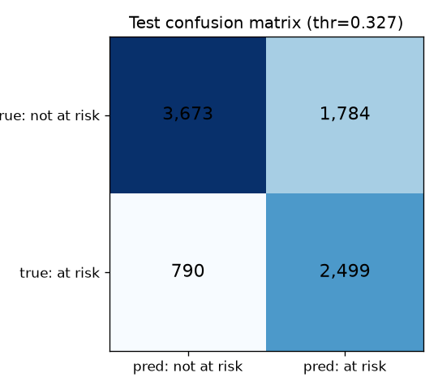
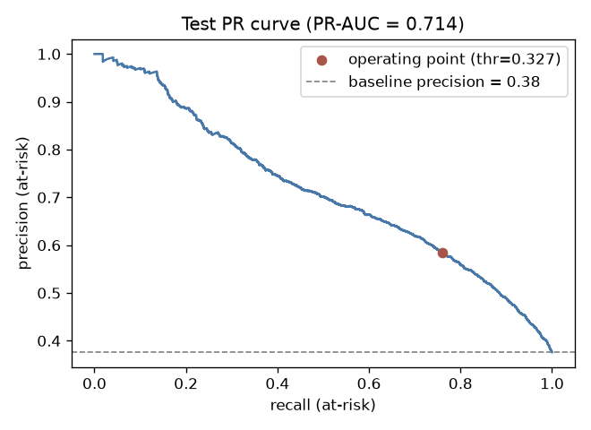

# Final Evaluation on the Test Split (2014J)

Model: **E4_xgboost** (see `reports/experiments_results.md`); operating threshold **0.327** tuned on validation. Test = 8,746 students of the 2014J cohort, never used before this evaluation.

## Headline results

| Model | Threshold | Recall (at-risk) | Precision | F1 | PR-AUC |
|---|---|---|---|---|---|
| Dummy (majority) | 0.5 | 0.000 | 0.000 | 0.000 | — |
| Logistic Regression | 0.5 | 0.584 | 0.672 | 0.625 | — |
| **XGBoost (final)** | 0.5 | 0.624 | 0.654 | 0.638 | 0.714 |
| **XGBoost (final)** | **0.327** | **0.760** | **0.583** | **0.660** | 0.714 |

Confusion matrix at the operating threshold:

|  | predicted not at risk | predicted at risk |
|---|---|---|
| **actually not at risk** | 3,673 (TN) | 1,784 (FP) |
| **actually at risk** | 790 (FN) | 2,499 (TP) |

## DQ-06 protocol: cold-start module CCC

- Full test set: recall 0.760, precision 0.583, f1 0.660
- Excluding CCC (no training data for it): recall 0.755, precision 0.566, f1 0.647

| Module | n | at-risk rate | recall | precision | f1 | note |
|---|---|---|---|---|---|---|
| AAA | 338 | 0.25 | 0.635 | 0.505 | 0.562 |  |
| BBB | 1,734 | 0.34 | 0.744 | 0.438 | 0.551 |  |
| CCC | 1,840 | 0.45 | 0.775 | 0.642 | 0.702 | **no training data (cold start)** |
| DDD | 1,393 | 0.43 | 0.790 | 0.666 | 0.723 |  |
| EEE | 990 | 0.31 | 0.657 | 0.703 | 0.679 |  |
| FFF | 1,761 | 0.37 | 0.789 | 0.600 | 0.681 |  |
| GGG | 690 | 0.36 | 0.768 | 0.548 | 0.640 |  |

## Fairness slices (at the operating threshold)

Flag rate = share of the group the model marks at-risk. Recall parity matters most here: are we missing struggling students more often in some groups?

**disability**

| group | n | at-risk rate | recall | precision | flag rate |
|---|---|---|---|---|---|
| False | 7,954 | 0.36 | 0.751 | 0.575 | 0.48 |
| True | 792 | 0.49 | 0.827 | 0.645 | 0.63 |

**gender**

| group | n | at-risk rate | recall | precision | flag rate |
|---|---|---|---|---|---|
| F | 3,702 | 0.36 | 0.748 | 0.512 | 0.52 |
| M | 5,044 | 0.39 | 0.768 | 0.641 | 0.47 |

**age_band**

| group | n | at-risk rate | recall | precision | flag rate |
|---|---|---|---|---|---|
| 0-35 | 5,977 | 0.39 | 0.787 | 0.591 | 0.52 |
| 35-55 | 2,688 | 0.35 | 0.695 | 0.564 | 0.43 |
| 55<= | 81 | 0.31 | 0.640 | 0.516 | 0.38 |

**imd_band**

| group | n | at-risk rate | recall | precision | flag rate |
|---|---|---|---|---|---|
| 0-10% | 770 | 0.46 | 0.856 | 0.604 | 0.65 |
| 10-20% | 856 | 0.44 | 0.810 | 0.622 | 0.57 |
| 20-30% | 926 | 0.43 | 0.805 | 0.647 | 0.54 |
| 30-40% | 929 | 0.38 | 0.744 | 0.596 | 0.48 |
| 40-50% | 870 | 0.37 | 0.778 | 0.562 | 0.51 |
| 50-60% | 877 | 0.37 | 0.747 | 0.583 | 0.48 |
| 60-70% | 850 | 0.35 | 0.673 | 0.541 | 0.44 |
| 70-80% | 831 | 0.36 | 0.765 | 0.597 | 0.46 |
| 80-90% | 772 | 0.32 | 0.707 | 0.500 | 0.46 |
| 90-100% | 709 | 0.30 | 0.695 | 0.516 | 0.40 |
| Missing | 356 | 0.27 | 0.589 | 0.615 | 0.26 |

## Error analysis: the students we miss (false negatives)

790 at-risk students were not flagged. Compared with the 2,499 we caught, they look far more 'healthy' at the cutoff:

| median at cutoff | missed (FN) | caught (TP) |
|---|---|---|
| early clicks | 460 | 201 |
| active days | 27 | 13 |
| TMA submitted | 2 | 1 |
| TMA mean score | 84 | 62 |

Interpretation: the missed students were still engaged and scoring reasonably during the first quarter of the course - their problems develop **later** than our prediction point. This is an honest limitation of a single early prediction point, not a pipeline bug; re-scoring students at later checkpoints would be the natural extension.

## Figures

## Conclusion

On a completely unseen future cohort the model catches **76%** of at-risk students (2,499 of 3,289) while **58%** of its flags are correct, versus 0% recall for the majority baseline and 58% for plain logistic regression. Performance holds without the cold-start module CCC (recall 0.755, precision 0.566, f1 0.647). The model is a decision-support ranking tool for advisors, not an automatic decision system; limitations and fairness observations above must accompany any use of the scores.
